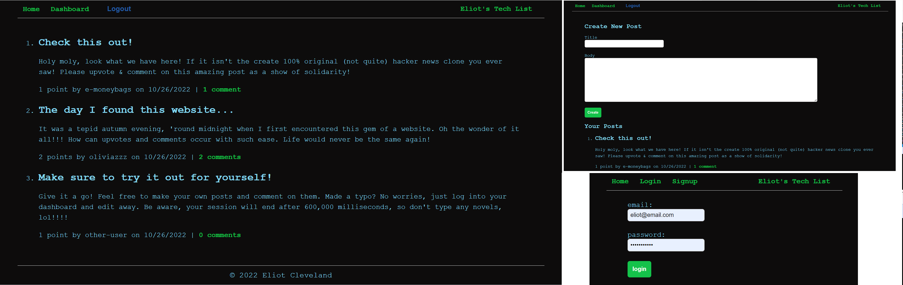

# eliots-tech-list
[](https://opensource.org/licenses/MIT)

**A basic blog format full stack application. Utilizes MySQL, Sequelize ORM, Node, Express and Handlebars. Deployed using Heroku. This was a great review of a lot of core concepts. Enjoy!**



## Table of Contents


[Link to Deployed Site](#link-to-deployed-site)

[Installation Instructions](#installation-instructions)

[Usage Information](#usage-information)

[Collaboration Credits](#collaboration-credits)

[Questions](#questions)

[License](#license)


## Link to Deployed Site

https://guarded-bayou-74585.herokuapp.com/
## Installation Instructions

To install locally, simply code the repository and run ``` npm install ```. You will need MySQL installed in advance and create a database in your root named eliots_tech_list_db. Not Recommended - Just run the app online 😊
## Usage Information

The app has an intuitive design and should be fairly self-explanatory
## Collaboration Credits

This is a homework challenge for a bootcamp
## Questions
For information about the developer, see my [GitHub Profile](https://github.com/eclevela-1234)

For general questions, please email me: eliothead@live.com
## License
Copyright (c)  2022 by [eclevela-1234](https://github.com/eclevela-1234)

MIT License

Permission is hereby granted, free of charge, to any person obtaining a copy
of this software and associated documentation files (the "Software"), to deal
in the Software without restriction, including without limitation the rights
to use, copy, modify, merge, publish, distribute, sublicense, and/or sell
copies of the Software, and to permit persons to whom the Software is
furnished to do so, subject to the following conditions:

The above copyright notice and this permission notice shall be included in all
copies or substantial portions of the Software.

THE SOFTWARE IS PROVIDED "AS IS", WITHOUT WARRANTY OF ANY KIND, EXPRESS OR
IMPLIED, INCLUDING BUT NOT LIMITED TO THE WARRANTIES OF MERCHANTABILITY,
FITNESS FOR A PARTICULAR PURPOSE AND NONINFRINGEMENT. IN NO EVENT SHALL THE
AUTHORS OR COPYRIGHT HOLDERS BE LIABLE FOR ANY CLAIM, DAMAGES OR OTHER
LIABILITY, WHETHER IN AN ACTION OF CONTRACT, TORT OR OTHERWISE, ARISING FROM,
OUT OF OR IN CONNECTION WITH THE SOFTWARE OR THE USE OR OTHER DEALINGS IN THE
SOFTWARE.

For more information visit https://opensource.org/licenses/MIT

